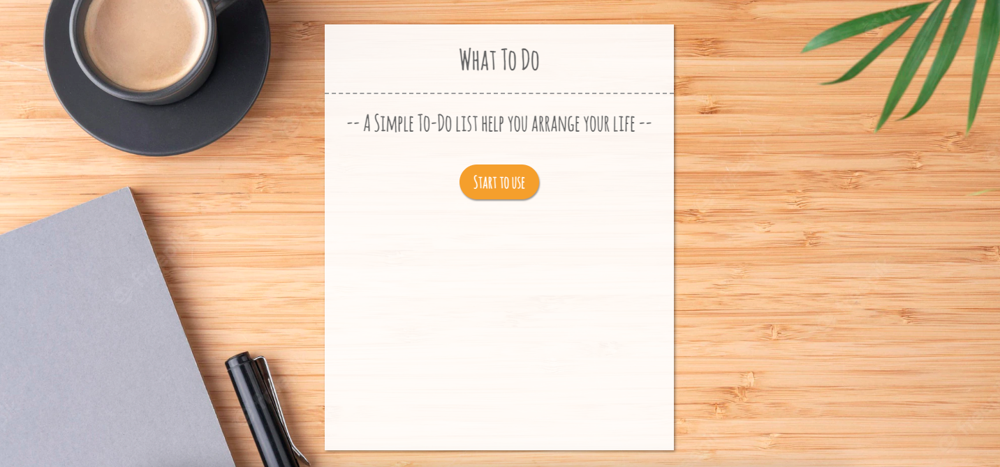
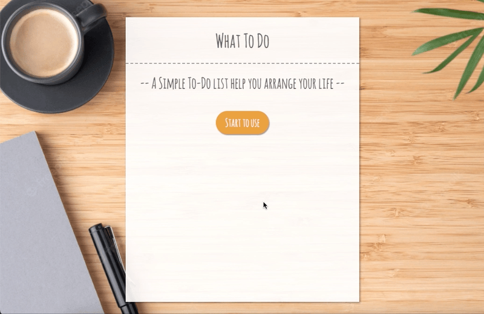
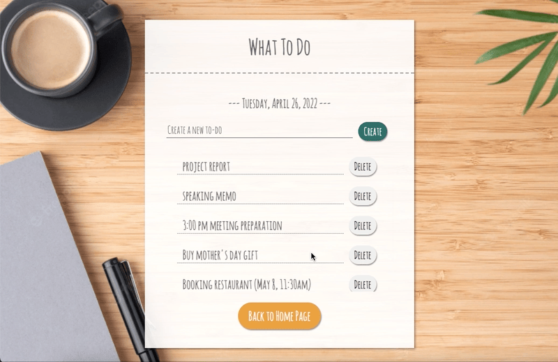

# what-To-Do

## A simple, easy-to-use To-Do List helps you arrange your daily tasks.

## ****Techniques****

- React
- Javascript
- CSS
- Webpack
- Babel
- Deployment: Firebase Hosting
- Database: Cloud Firestore

## Features

- Today’s date shows on the top of the input field.
- Creating to-do items without limiting words or item numbers.

- Deleting items that are finished or do not need.

## Resources

- Font: [https://www.1001freefonts.com/amatic-sc.font](https://www.1001freefonts.com/amatic-sc.font)
- background: [https://www.freepik.com/free-photos-vectors/desk-office](https://www.freepik.com/free-photos-vectors/desk-office)